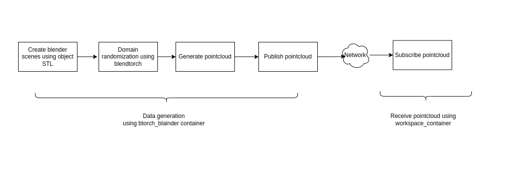
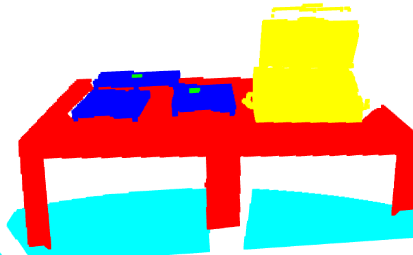

3D Synthetic point cloud data generation using Blendtorch and rangescanner. 
Overview
This repository is for generating synthetic data for training using Blender scenes generated using STL of 3D objects on blender. Apply material property and texture using the dtd directory, find more textures from dtd dataset here here (https://www.robots.ox.ac.uk/~vgg/data/dtd/ ). In my project the realsense D435i data has been used as a realdata and the realdata has been manually labelled using SegmentsAI(https://segments.ai/). The container is to generate 3D pointcloud synthetic data with class labels. 

**How does the pipeline work?**


The pipeline works this way:


## Installation 

Build, start and enter the container.

```bash
bash build.bash
```

```bash
bash create.bash
```

```bash
bash start.bash
```

Once in container start blender application from command line simply with `blender` and activate range_scanner(https://github.com/ln-12/blainder-range-scanner) Plugin under `Edit -> Preferences -> AddOns -> Testing`

When first creating the container, the .config/blender directory seems to be created by the root user.
Change the permissions with the following command:

```bash
sudo chown -R $USER:$USER .config
```
**##Create blender scenes**

Use blender and create the blender scene you want as your synthetic data with STL of objects. Apply texture and Uv maps.
Use camera rotation to generate multiple instances of the blender scenes for more number of initial scenes. This will help to create better training data. 
The model learns better in case of data augmentation and domain randomization.

## Textures

Download the [DTD dataset](https://www.robots.ox.ac.uk/~vgg/data/dtd/) and describe the path to the directory in the docker-compose.yml file.
To specify which textures should be used for the domain randomization, create a file for each object/object group, like shown in [the configuration](#configuration)

# Usage

## Configuration

This repository implements domain randomization for Blender-based synthetic scenes and generates semantically labeled 3D point clouds from these randomized environments. To provide user-level control and modularity, the system utilizes configuration files.
Each Blender scene is associated with a dedicated scene-specific configuration file that defines parameters for domain randomization, such as object translation, scaling, and rotation within realistic bounds. In addition, a global configuration file is provided to define shared parameters and object-level metadata applicable across all scenes.
Domain randomization constraints can be specified either globally or per scene. Scene-specific configuration files override the corresponding settings in the global configuration file, allowing fine-grained control over the variability and realism of individual scenes. The global configuration also maintains a registry of objects consistently present across all Blender scenes.

There are two sets of  configuration files to
### Scene specific files
Scene-specific configuration files define parameters that control object-level domain randomization and camera viewpoints for a given Blender scene. These files adhere to the following structure and rules:

objects: Specifies domain randomization parameters (e.g., translation, rotation, scale) for individual objects. Each object name must match exactly with the corresponding object name in the Blender scene hierarchy.

cam_pos: Defines a list of fixed camera positions and orientations (typically as 4x4 transformation matrices or position-rotation tuples). These positions are used iteratively during data generation. Additionally, random perturbations may be applied around these fixed poses to increase variability.

default_values: Defines shared randomization rules for groups of objects whose names contain a specified substring. This is particularly useful when multiple instances of similar objects exist (e.g.,table1,table2, etc.).

The objects section enables fine-grained control over specific scene elements, while default_values allows batch application of constraints based on name patterns. If a rule is defined in both objects and default_values, the object-specific rule takes precedence.
These files can be found in

```json
  "default_values":
  {
    "storage_bin":
    {
      "trans_dim_enabled": "XZ"
    },
    "working_place":
    {
      "scale_dim_enabled": "XY",
      "rot_dim_enabled": "Z",
      "remember_orig_values": "True",
      "visibility_enabled": "False"
    },
    "table":
    {
      "visibility_enabled": "False",
      "remember_orig_values": "True"
    }
  }
```

The scene specific file also has the camera positions used in the data generation:

```json
"cam_pos":[
    {
      "location": "1.3057,-1.22050,1.7292",
      "orientation": "0.6324,0.22109,-2.19049"
    },
    {
      "location": "1.3010,-1.33020,1.7292",
      "orientation": "0.6328,0.01774,-1.57282"
    }
  ],

```

These values represent camera positions in the specific blender scene. These will be used to generate point clouds from different point of views.
The location is in metres and the orientation is in radian. Per default blender uses degree to visualize rotations but in the python API radian is used.
So don't forget to change the unit in Blender to radian (on the right side -> scene properties).

### Global config file

```json
"table":
    {
      "visibility_enabled": "False",
      "remember_orig_values": "True"
    }
  }
```


### Providing labels to the blender scene

Each object has to have a custom property *categoryID*.
With this property, blainder generates the labels for each point in the point cloud.


To enable semantic labeling of objects in the generated point cloud, each object in the Blender scene must be assigned a custom property named categoryID. This property determines the class label that will be associated with each point belonging to the object during point cloud generation.
To add this property:
Select the object in Blender.
In the Object Properties panel, add a custom property named categoryID.
Set its value to the desired class index.
Refer to the image below for a visual example:

Create a property like shown here:


UV Mapping for Texture Projection
Proper UV mapping is required for realistic texture projection and rendering. To unwrap an object’s UVs:
Select the object.
Enter Edit Mode by pressing Tab.
Press U and choose Unwrap.
Alternatively, press U and select Smart UV Project for automated mapping.
Note: UV unwrapping might take a few seconds for high-complexity meshes.

Adding a New Camera
Camera parameters used in simulation are defined in the configuration file presets.yaml. To add a new camera:
Open the YAML file.
Follow the existing format to define the new camera's intrinsic and extrinsic parameters.
Ensure that each camera entry has a unique ID.
After defining the camera in the configuration file, it can be referenced during scene rendering and point cloud generation.


## Starting the process

Change the working directory to either [this](./arbeitsraumerkundung/pytorch-blender/modproft/) or to [this](./arbeitsraumerkundung/pytorch-blender/pkg_blender/blendtorch/btb/')
Launching the process can be done like described in the [BlendTorch repository](https://github.com/cheind/pytorch-blender)

```bash
blendtorch-launch launch.json
```

To decide which Blender scenes should be used there is [this file](./arbeitsraumerkundung/pytorch-blender/modproft/scenes.json') as determined in the [launch.json](./arbeitsraumerkundung/pytorch-blender/modproft/launch.json).
Here the Blender scene and the according scene specific config file has to be given.


Additionally there is the possibility to let the process run, without having to have to receiving side running. Therefore, in the [this file](./arbeitsraumerkundung/pytorch-blender/modproft/generate_training_data.py) change the publish attribute to *False*.
When doing this, the results will not be stored except an export option is set to True in [this file](./arbeitsraumerkundung/pytorch-blender/pkg_blender/blendtorch/btb/animation_methods.py) when scanning the world.


Generated pointcloud with label would look like


The data which is generated can be pubished and the repo workspace_container can be used to receive the data.
