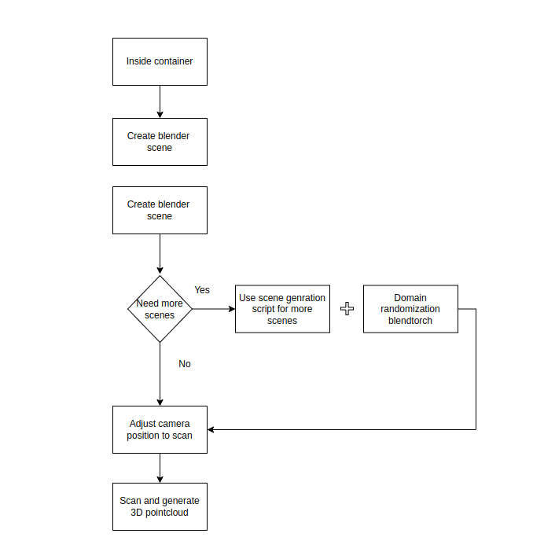

# synth-data-generation

Synthetic data generation for workspace exploration with BlAInder and BlendTorch

[TOC]

# Overview

This repository is for generating synthetic data for 3D point cloud processing. With [BlAInder](https://github.com/ln-12/blainder-range-scanner) it is possible to generate synthetic and automatically labelled point clouds.
As in the KIraF use case, a neural network was trained for predicting semantic labels in a point cloud, another framework - [BlendTorch](https://github.com/cheind/pytorch-blender) - was integrated.
BlendTorch was used as basis for domain randomization.
Multiple Blender scenes will be used as basis for domain randomization methods and for semantic point cloud generation.


When starting a synthetic data generation, a receiving side has to be available. Follow therefore the instuctions in [the ros-deepview](https://gitlab.elektrotechnik.hs-augsburg.de/ttz/kiraf/ros-deepview) repository.

The process when generating synthetic data can be seen in this image:



## Installation 

Build, start and enter the container with

```bash
bash build.bash
```

```bash
bash create.bash
```

```bash
bash start.bash
```

Inside the container start blender from command line simply with `blender` and activate range_scanner Plugin under `Edit -> Preferences -> AddOns -> Testing`

When first creating the container, the .config/blender directory seems to be created by the root user.
Change the permissions with the following command:

```bash
sudo chown -R $USER:$USER .config
```

## Textures

Download the [DTD dataset](https://www.robots.ox.ac.uk/~vgg/data/dtd/) and describe the path to the directory in the docker-compose.yml file.
To specify which textures should be used for the domain randomization, create a file for each object/object group, like shown in [the configuration](#configuration)

# Usage

## Configuration

In general, this repository implements a domain randomization on Blender scenes and generating semantically labelled point clouds from these scenes.
The user should have control over this, so a few configuration files are created for this.
Every Blender scene has its own specific configuration file and additionally to this, there is a general config file for all Blender scenes.
In parallel the domain randomization can be limited in scene specific or a global config
file, i.e. translation, scaling or rotations of the objects in the Blender scene will be held in a realistic range.
The global config file has information about objects that are present in every Blender scene.
Scene specific config files only hold domain randomization restrictions about objects in this scene and would overwrite restrictions described in the global config file.

For generating data in your application, a few steps have to be done. 
An overview over the framework can be seen here:


### Scene specific files

The scene specific file follows these rules:

- objects → apply rules to individual objects. The name defined here must match
exactly the name defined in Blender
- cam_pos → user-defined camera positions and orientations
- default_values → apply rules to a group of objects that have a name defined in

Blender that contains the string defined in the JSON file
The entry objects contains all objects in the Blender scene for which the user wants to
have specific restrictions. The name of the object here must match exactly the one in the
Blender scene. The camera positions defined in the entry cam_pos are used iteratively
in the data generation. Not only these fixed values will be used, but also randomly chosen
positions starting from these fixed positions. An example situation when you need the
definition in default_values would be if there are multiple boxes in the scene and their
names are „klt, klt.001, klt.002, . . . “. This numbering is the default when using Copy-
Paste of objects in Blender. If the user defines an entry in the JSON file like shown in

```json
  "default_values":
  {
    "storage_bin":
    {
      "trans_dim_enabled": "XZ"
    },
    "working_place":
    {
      "scale_dim_enabled": "XY",
      "rot_dim_enabled": "Z",
      "remember_orig_values": "True",
      "visibility_enabled": "False"
    },
    "table":
    {
      "visibility_enabled": "False",
      "remember_orig_values": "True"
    }
  }
```

Keys that are availalble to influence the domain randomization are the following:

| Key                  |  Data type  |                                                                                                Functionality                                                                                               | Example value         |
|----------------------|:-----------:|:----------------------------------------------------------------------------------------------------------------------------------------------------------------------------------------------------------:|-----------------------|
|  translation_enabled |   boolean   |                                                                                  Enable/disable translation of the object                                                                                  | True/true/False/false |
|   rotation_enabled   |   boolean   |                                                                                    Enable/disable rotating of the object                                                                                   | True/true/False/false |
|    scaling_enabled   |   boolean   |                                                                                    Enable/disable scaling of the object                                                                                    | True/true/False/false |
|   material_enabled   |   boolean   |                                                                Enable/disable material adaptions of the object, e.g. roughness, specularity                                                                | True/true/False/false |
|    texture_enabled   |   boolean   |                                                                              Enable/disable changing the texture of the object                                                                             | True/true/False/false |
|  visibility_enabled  |   boolean   |                                                                              Not recommended! Toggle visibility of the object                                                                              | True/true/False/false |
|  trans_min/trans_max | List[float] |                                                                Minimum and maximum values for translation of the object in each axis (x,y,z)                                                               |    [0.1, 0.2, 0.3]    |
|  trans_min/trans_max | List[float] |                                                           Minimum and maximum values for rotation (radian) of the object around each axis (x,y,z)                                                          |    [0.1, 0.2, 0.3]    |
|  trans_min/trans_max | List[float] |                                                                  Minimum and maximum values for scaling of the object in each axis (x,y,z)                                                                 |    [0.1, 0.2, 0.3]    |
| remember_orig_values | boolean     | True, if the randomization method should start from original values of an object in the scene, False when continue from the current position,  e.g. if the object is scaled multiple times in different situations | True/true/False/false |
| texture_img_src      | String      | Path to file that describes the textures allowed for this object/object group, **give absolute file path** | /home/vinayaka/dtd/labels/table.txt |

**For every key there are default values in the code except for texture_img_src**.

The scene specific file also has the camera positions used in the data generation:

```json
"cam_pos":[
    {
      "location": "1.3057,-1.22050,1.7292",
      "orientation": "0.6324,0.22109,-2.19049"
    },
    {
      "location": "1.3010,-1.33020,1.7292",
      "orientation": "0.6328,0.01774,-1.57282"
    }
  ],

```

These values represent camera positions in the specific blender scene. These will be used to generate point clouds from different point of views.
Not only these positions will be used directly but these positions also can be randomized. 
The location is in metres and the orientation is in radian. Per default blender uses degree to visualize rotations but in the python API radian is used.
So don't forget to change the unit in Blender to radian (on the right side -> scene properties).

### Global config file

Similar to the default_values in the scene specific file, a group of objects can be parameterized with one entry in [this file](./arbeitsraumerkundung/pytorch-blender/kiraf/defaults.json').

```json
"table":
    {
      "visibility_enabled": "False",
      "remember_orig_values": "True"
    }
  }
```

In every scene that will be used in the data generation process, every object that has "table" in its name, will be parameterized with these values.
If the same group of objects will be parameterized in the scene specific config file, the configuration from the scene specific config file will be used.

## Creating a new blender scene

In Blender when creating a new scene two things have to be considered:

- Providing the labels for each object
- Creating an UV mapping for textures

### Providing labels

Each object has to have a custom property *categoryID*.
With this property, BlAInder generates the labels for each point in the point cloud.

Create a property like shown here:


Attention: BlAInder distinguishes between "1.0" and "1", so be careful to have all objects that belong to one class, have exactly the same label.

### UV mapping

1. Select the object
2. Switch to Edit mode (on the keyboard "tab")
3. Keyboard "u", click unwrap
4. Keyboard "u", click smart uv project

Step 3 and 4 may take some time with complex models.

## Adding a new camera

There is a [config file](./range_scanner/ui/presets.yaml) in BlAInder that is used to describe the parameters of a camera that should be simulated.
Add a new camera as in the examples shown in this file.
The ID should be unique.

If you want to use the newly created camera, change the identifier in [this file](./arbeitsraumerkundung/pytorch-blender/pkg_blender/blendtorch/btb/animation_methods.py) when calling the scan function in post_play method.

## Starting the process

Change the working directory to either [this](./arbeitsraumerkundung/pytorch-blender/kiraf/) or to [this](./arbeitsraumerkundung/pytorch-blender/pkg_blender/blendtorch/btb/')
Launching the process can be done like described in the [BlendTorch repository](https://github.com/cheind/pytorch-blender)

```bash
blendtorch-launch launch.json
```

To decide which Blender scenes should be used there is [this file](./arbeitsraumerkundung/pytorch-blender/kiraf/scenes.json') as determined in the [launch.json](./arbeitsraumerkundung/pytorch-blender/kiraf/launch.json).
Here the Blender scene and the according scene specific config file has to be given.


Additionally there is the possibility to let the process run, without having to have to receiving side running. Therefore, in the [this file](./arbeitsraumerkundung/pytorch-blender/kiraf/generate_training_data.py) change the publish attribute to *False*.
When doing this, the results will not be stored except an export option is set to True in [this file](./arbeitsraumerkundung/pytorch-blender/pkg_blender/blendtorch/btb/animation_methods.py) when scanning the world.

## Debugging blender

Debugging in Blender in not natively supported.
If you want to debug a Python script you are running in Blender then you need to have `debugpy` installed in this environment.

In the main script you add the following lines to your code:

```python
import debugpy
debugpy.listen(5678) # listen on port 5678, choose the port how you like
debugpy.wait_for_client() # wait for vs code to attach to process
```

In VS code you create a launch.json file like the [one here](./arbeitsraumerkundung/pytorch-blender/pkg_blender/blendtorch/btb/.vscode/launch.json).
The port in the launch.json file has to match the one given as parameter to debugpy.

Now first start the blender process with 

```bash
blendtorch-launch launch.json # not the launch.json from vscode
```

Open VS Code in the folder containing the python script to run -> Run Tab -> Select `Attach` as Debug Option
Now the script starts to run and you should be able to add breakpoints anywhere in your script.
